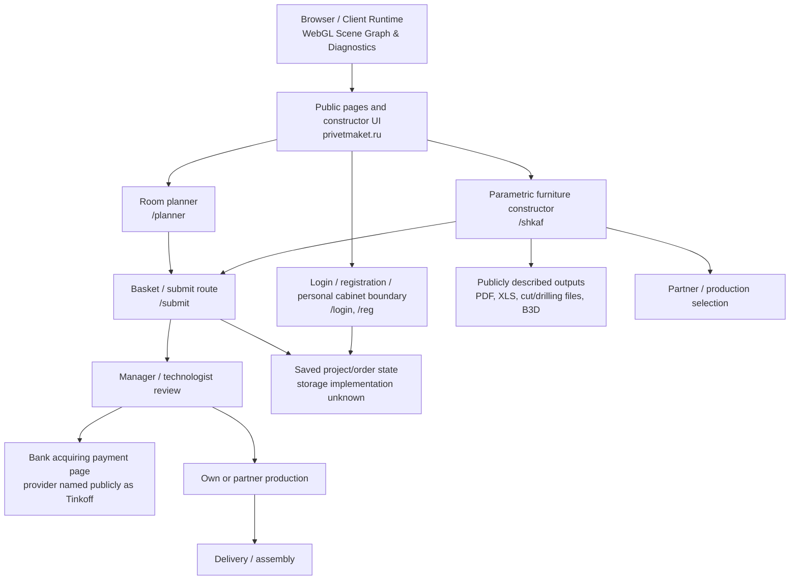
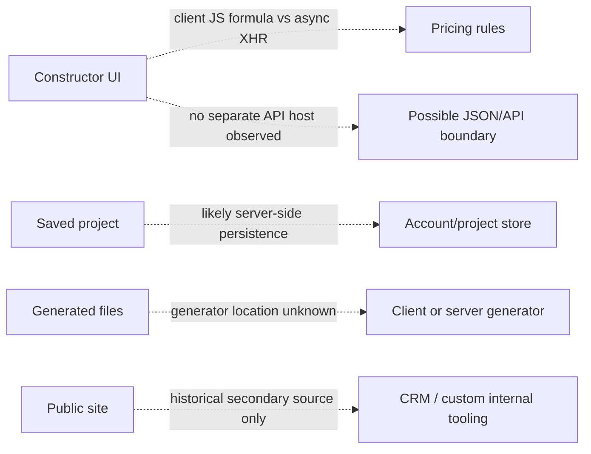

# Architecture Map

**Result:** `PARTIAL`  
**Checkpoint:** `CP-02`  
**Rule:** в основной карте показаны только наблюдаемые публичные роли. Точные API/service boundaries, storage type и framework не добавляются как факты.

## Evidence-backed public workflow

### What this map means

- `Browser / Client Runtime`: Confirmed by live WebGL diagnostics (`EVIDENCE-019`) to execute client-side rendering with explicit budgets (`draw calls <= 300`, `triangles <= 500k`, `JS heap <= 256 MB`). Scene manipulation (geometry, mesh updates, cell divisions) runs locally in browser memory.
- `PublicFrontend`, `Constructor`, `Planner`, `Basket`, `Auth` and `Exports` are evidenced by public pages and visible UI labels: [EVIDENCE-001](evidence/frontend/EVIDENCE-001-homepage.md), [EVIDENCE-002](evidence/frontend/EVIDENCE-002-constructor.md), [EVIDENCE-004](evidence/endpoints/EVIDENCE-004-auth-and-basket.md), [EVIDENCE-008](evidence/frontend/EVIDENCE-008-planner.md), [CP02_NETWORK_MANIFEST](evidence/endpoints/CP02_NETWORK_MANIFEST.md).
- `Review → Bank → Production → Delivery` is a published customer workflow, not a captured request trace: [EVIDENCE-007](evidence/endpoints/EVIDENCE-007-order-payment.md), [EVIDENCE-009](evidence/frontend/EVIDENCE-009-partners-and-production.md).
- `Tinkoff` is a public textual claim on the order-help page. The exact acquiring hostname, API, callback and token flow are not mapped.
- `ProjectState` is a boundary label, not a claim about a specific database. The site states that project/order parameters are available in a personal cabinet and exposes save/planner flows; storage implementation remains unknown: [EVIDENCE-008](evidence/frontend/EVIDENCE-008-planner.md), [EVIDENCE-009](evidence/frontend/EVIDENCE-009-partners-and-production.md).

## Hypotheses kept separate

These are not confirmed components. The following evidence is insufficient to promote them to FACT:

- no browser Network export with request/response metadata (CP-02 DevTools HAR blocked in current sandbox);
- no raw public JS bundle analysis;
- no response headers available from the current tool context;
- no successful authenticated project-save/order flow was attempted;
- historical CRM/CNC statements may not describe the current deployment: [EVIDENCE-015](evidence/frontend/EVIDENCE-015-historical-architecture.md).

## Not shown intentionally

There is no confirmed standalone `API`, `GraphQL`, `WebSocket`, `SSE`, object storage, CDN, analytics endpoint, CRM host, or production-export host in the main diagram. Route names such as `/default/index/...`, `/orders`, `/users`, and `/partners` establish a public route surface, not an API contract: [EVIDENCE-003](evidence/endpoints/EVIDENCE-003-robots-and-route-surface.md).
